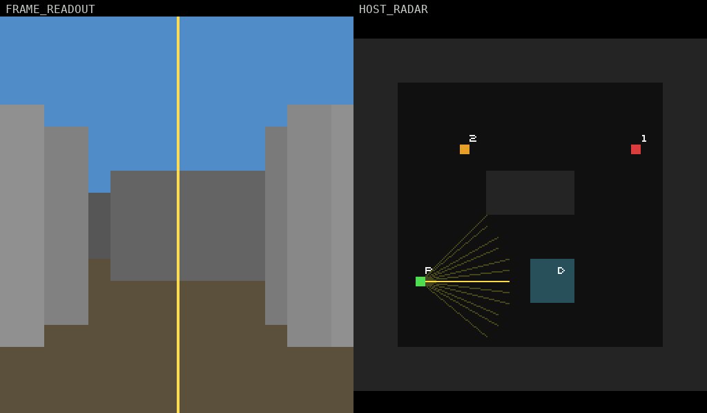
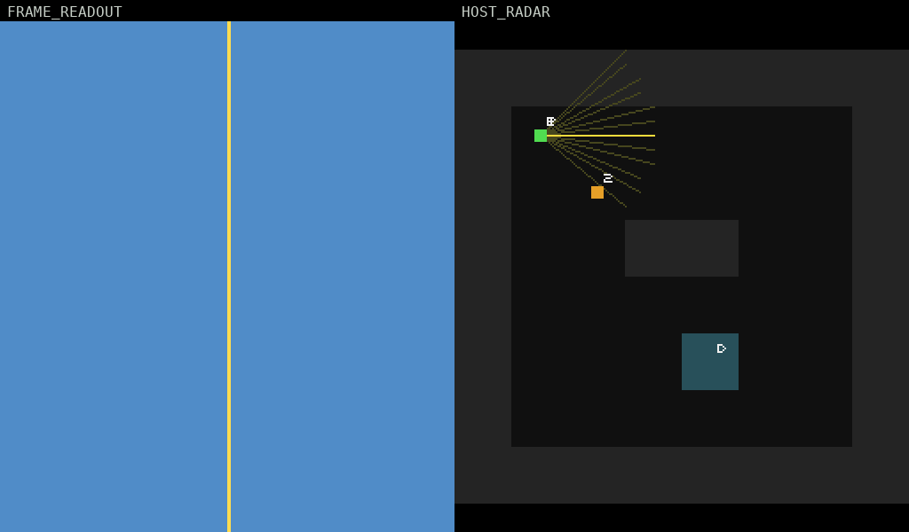
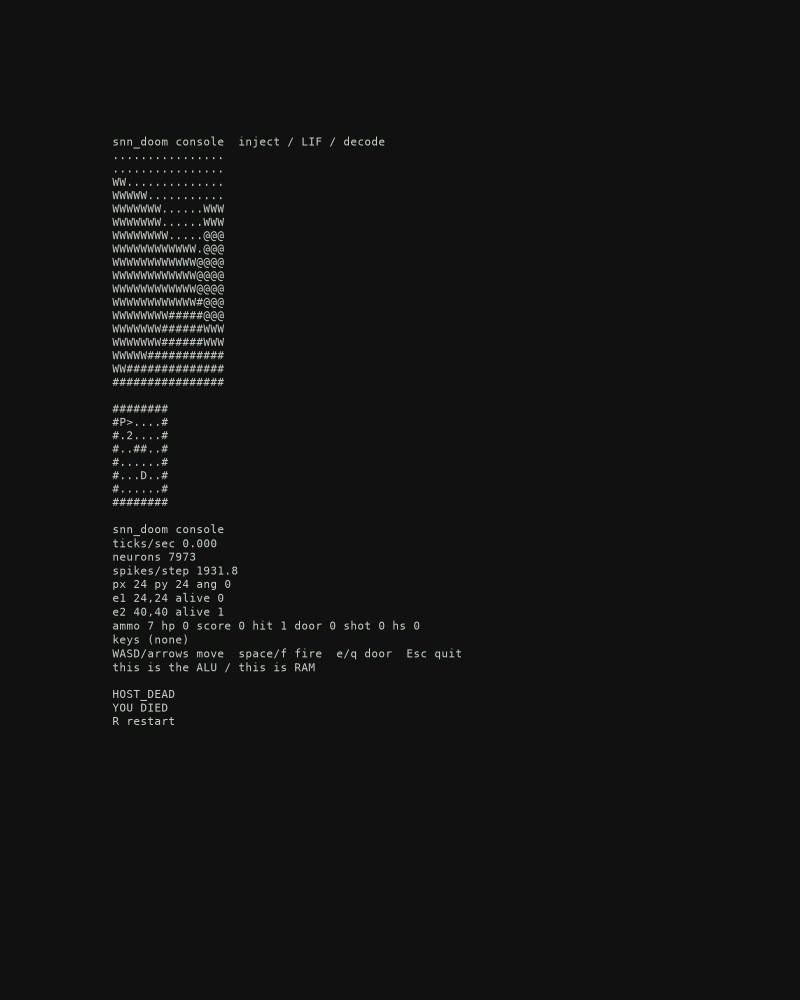

# snn_doom

A fruit fly was mapped. People taught that map to play DOOM...but this is not that. This is *farrr* more cursed. 

This repo doesn't showcase the fly brain playing DOOM. The fly brain *is* a DOOM engine, each neuron is remapped with a sole function, to run DOOM. Python only injects six keys, steps the circuit, and decodes the color lines. That's it. It does none of the heavy lifting, even thought it CAN technically run DOOM by itself without a fly.

## Play

```bash
python -m venv .venv && .venv/bin/pip install -e ".[play]"
.venv/bin/python -m snn_doom.play
# WASD / arrows  move
# space / f      fire
# e / q          door
# Esc            quit
```

Same loop: `scripts/run_demo.py --play`. Default is the 16×18 VIEW, raster hidden, door at (4,5) closed. `--lab` shows the spike raster. `--fast` skips it. `--scale 32` is chunky pixels. `--map corridor|arena|door`. `--tty` is the terminal view. `--fwd` holds forward. `--ghost logs/runs/held_fwd.bits` overlays a recorded path. `--no-radar` hides HOST_RADAR. `--no-dead` closes on death instead of HOST_DEAD.



HOST_DEAD:



TTY:



All the technical bits: [docs/methodology.md](docs/methodology.md).

```bash
.venv/bin/python -m pytest tests/ -q
.venv/bin/python scripts/run_teacher.py --steps 4
.venv/bin/python scripts/run_demo.py --frames 1
.venv/bin/python -m snn_doom.play
.venv/bin/python scripts/ablate.py
```

CI does not open a window.


